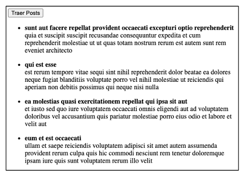

# Desafío - Traer Posts

💡 Realizado [cristiandpto23](https://github.com/cristiandpto23) con HTML y JS 
➡ Front-End G17 - Desafío Latam 
🔗 Desplegado en Vercel [aquí]() 

## Introducción

_En este desafío validaremos nuestros conocimientos trabajando con APIs y Manejo de errores._

## Descripción

En desarrollo web, es muy importante trabajar consumiendo datos desde diversas fuentes, entre ellas APIs. En este desafío consumirás datos desde la siguiente [API](https://jsonplaceholder.typicode.com/posts), la cual nos devuelve un arreglo con "posts" de ejemplo.

Al pulsar sobre un botón, realizaremos la llamada a la API y mostraremos los datos de los post obtenidos, como en la siguiente imagen de muestra:

## Requerimientos

1. Realizar un request (consulta) a la API usando async-await.
2. Mostrar el resultado del request en HTML (utilizar listas desordenadas para mostrar cada uno de los post).
3. Manejar los posibles errores con try-catch.

## Tecnologías usadas

 
